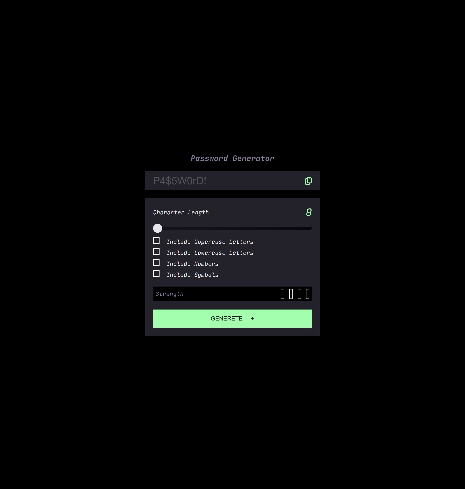
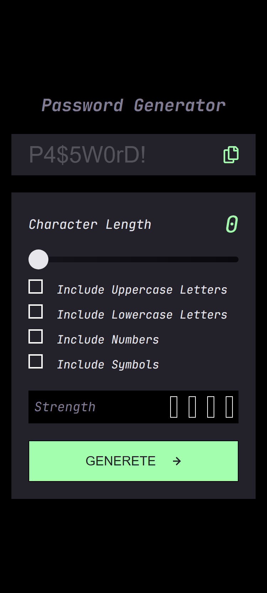

# Frontend Mentor - Password generator app solution

This is a solution to the [Password generator app challenge on Frontend Mentor](https://www.frontendmentor.io/challenges/password-generator-app-Mr8CLycqjh). Frontend Mentor challenges help you improve your coding skills by building realistic projects.

## Table of contents

- [Overview](#overview)
  - [The challenge](#the-challenge)
  - [Screenshot](#screenshot)
  - [Links](#links)
- [My process](#my-process)
  - [Built with](#built-with)
  - [What I learned](#what-i-learned)
  - [Continued development](#continued-development)
- [Author](#author)
- [Acknowledgments](#acknowledgments)

## Overview

### The challenge

Users should be able to:

- Generate a password based on the selected inclusion options
- Copy the generated password to the computer's clipboard
- See a strength rating for their generated password
- View the optimal layout for the interface depending on their device's screen size
- See hover and focus states for all interactive elements on the page

### Screenshot


| Desktop                        | Mobile               | Tablet |
| ------------------------------ | -------------------- | ---------------------- |
|  |  |  |

### Links

- Solution URL: [Add your GitHub Repo URL here](https://github.com/your-username/repo-name)
- Live Site URL: [Add your Live Site URL here](https://your-live-site-url.com)

## My process

### Built with

- Semantic HTML5 markup
- CSS custom properties
- CSS Grid & Flexbox
- Mobile-first workflow
- Vanilla JavaScript (ES6+)

### What I learned

This project has been one of the most exciting and educational projects I have built so far. It went beyond just styling; constructing the logic and algorithm behind the password generation significantly boosted my motivation.

I reinforced my understanding of JavaScript fundamentals, particularly DOM manipulation, `forEach` loops, and Event Listeners (`click`, `input`).

Here are the key concepts I learned and implemented:

**1. Guard Clauses (Clean Code):**
I learned a technique to return early if a condition isn't met. This prevents the code from running unnecessarily. In this case, if the input field is empty, the function stops immediately.

```js
// If the field is empty, stop the function
if (!passwordGenText.value) return;
```

**2. Clipboard API:**
I learned how to use the modern `navigator` object and the `writeText()` method to copy text to the user's clipboard programmatically.

```js
// Copying generated password to clipboard
navigator.clipboard.writeText(passwordGenText.value);
```

**3. UX Improvement with setTimeout:**
To improve the user experience, I ensured the "COPIED" text doesn't stay on the screen forever. I used `setTimeout` to hide the message after 2 seconds.

```js
// Visual feedback that disappears after 2 seconds
setTimeout(() => {
  copyBtnText.style.display = "none";
}, 2000);
```

**4. Algorithm Logic:**
Building the logic to create a "character pool" based on user selections and generating a random string from that pool was a great exercise in algorithmic thinking.

```js
// Example of logic structure
let passwordPool = "";
if (uppercaseCheckbox.checked) passwordPool += uppercaseChars;
// ... other checks ...

for (let i = 0; i < slider; i++) {
  let randomOrder = Math.floor(Math.random() * passwordPool.length);
  passwordGenText.value += passwordPool[randomOrder];
}
```
### Continued development

In future projects, I want to continue focusing on writing cleaner, modular JavaScript code. This project helped me realize how important logic building is, and I plan to apply these skills as I move towards more complex applications and eventually backend development.

## Author

- Frontend Mentor - [@Emelinur](https://www.frontendmentor.io/profile/Emelinur)
- Github - [@Emelinur](https://github.com/Emelinur)

## Acknowledgments

I would like to thank the open-source community and documentation resources that helped me understand the Clipboard API and advanced DOM manipulation techniques.